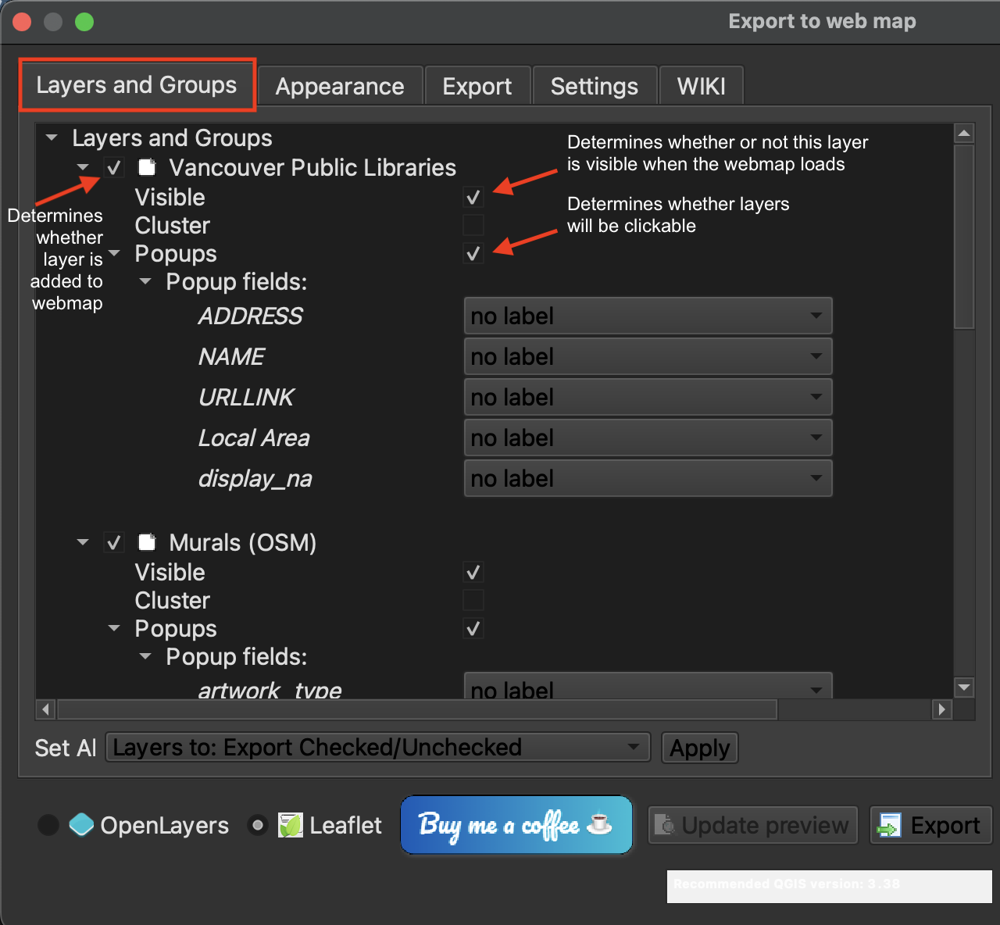

# Creating a webmap with qgis2web plugin

## 1. Open qgis2web 
Open the **qgis2web** plugin from the **Web** menu at the top of your screen. Chose **Create web map**.
    

## 2. Power your webmap with Leaflet
Change the code library powering your webmap to **Leaflet**. 
    

## 3. Layers and Groups
**Layers and Groups** refers to everything that was in your Layers Panel. At this point, you can decide which layers are added to your webmap, whether they are visible upon intial load, and whether or not they have popups (and if so, whether these popups are labeled). Notice that the popup fields listed are only the ones you left visible when setting field visibility. If you choose to give your popups labels, they will reflect any aliases you set.

## 4. Appearance
In the **Appearance** tab, you can specify whether your webmap has a title and abstract, or description. You can also indicate whether you want your Layers list, or legend, expanded or collapsed upon initial load.

## 5. Export
It's time to export your map. Set the export **folder** to the workshop folder, but not the data subfolder. When the qgis2webmap tool runs, it will output a separate folder containing your data as well as styling for the webmap. 

Uncheck minify geojson files. The files are not that large so this is not necessary. 

finally, hit **export**. The run time should only be a moment as the datasets are not that large. You should get green messages if it works. 655

