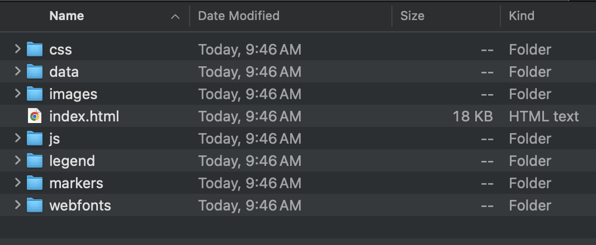

# Exploring your webmap

From your computer's finder window, navigate to the workshop folder. Inside you should now see a new folder called qgis2web followed by the date. Open this folder. 

Inside you will see a handful of subfolders. 

> - **css** contains the cascading style sheets responsible for the synology of your map layers. 
> - **data** contains your data layers
> - **images** contains any images
> - **js** contains the javascript code which powers the interactivity of your webmap 
> - **legend** contains your legend's icons 
> - **markers** would contain any markers on your map 
> - **webfonts** contains the font families of map text

There is also an `index.html` document. [Html](https://www.w3schools.com/Html/), or hyper text markup language, is the language read by web browsers. Either double-click this file or right-click and choose to open it with a web browser of your choice. Google Chrome is recommended. 

Your webmap should load in a web browser:

 
Try interacting with your map!
- Check and uncheck the visibility of different layers
- Collapse and expand the layers list
- Zoom in and zoom out; pan around
- Click on different points and explore the pop-up information

Make note of the attribution at the bottom right corner of your webmap. 

If you want to change anything, you can always return to QGIS and re-run qgis2web. It will create a new output folder each time. Though each successive output folder will be date and timestamped, it's helpful to delete or discard deprecated folders so as to remain organized. If you want to make any edits directly from the Leaflet code, check out the Research Commons [Webmapping with Leaflet](https://ubc-library-rc.github.io/gis-intro-leaflet/) workshop. 

Notice the file path in your browser's search bar. You should recognize it as referencing the location of your qgis2web output's `index.html` file local to your computer. Because this map is stored on your local device, it can't be searched via the web by others. To share the map as is, you'd have to send the entire folder to someone along with instructions on how to download and open your map. **The next page will guide you through making this map accessible via the web.**

<!-- ## Codeside view

You can also explore - as code - and adjust things from that end. lets take a look at codeside view of html document, just for fun. again, leaflet workshop will  delve more into this.  -->

