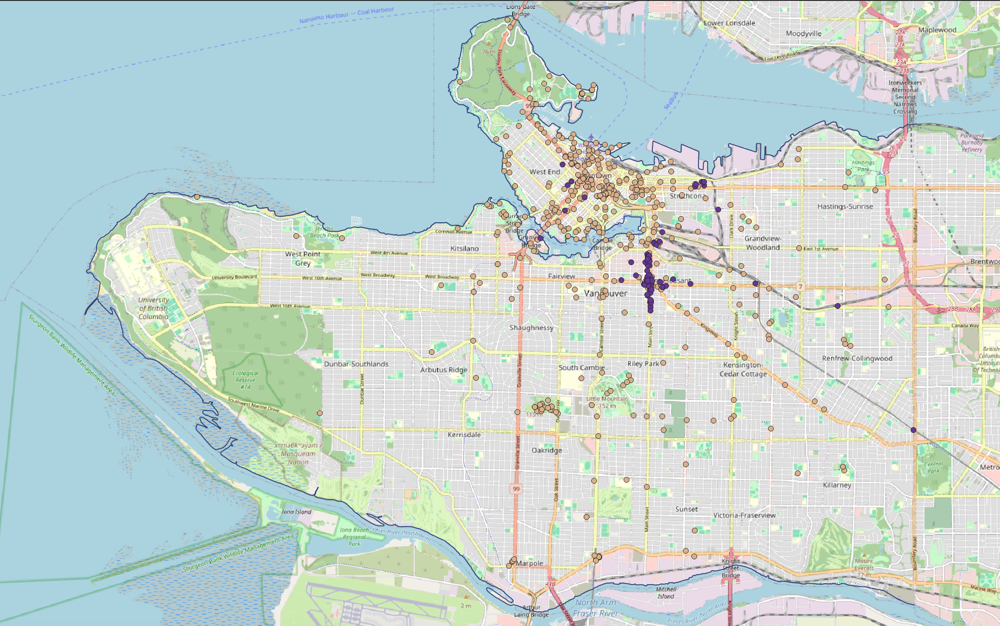

# Extract OSM data with QuickOSM plugin
[QuickOSM](https://docs.3liz.org/QuickOSM/) is a plugin that allows you to query and download Open Street Maps (OSM) data for specific areas directly to your local computer for offline use. Having your own copy of OSM data is useful if you're running network analysis or otherwise want to modify infrastructural spatial data. While applications like [overpass turbo](https://overpass-turbo.eu/) allow you to do something similar on the web, QuickOSM is a tool specifically designed for use within the QGIS interface. 

 

*1*{: .circle .circle-purple} Add the **OSM Standard** basemap to project and drag beneath your other data layers. Zoom to `van-shoreline`.

    
 

*2*{: .circle .circle-purple} From the **Plugins** menu at the top of your screen, navigate to**Manage and Install Plugins…** In the Plugins dialogue box that opens, first go to Settings and enable experimental and deprecated plugins. Return back to All and search “QuickOSM.” Install the plugin and close the dialogue box. 
    

 

*3*{: .circle .circle-purple} Now click on the **Vector** menu at the top of your screen and go to **QuickOSM**. (Note you can also search for the tool in your Processing toolbox, or from the Help menu.)

    
  

*4*{: .circle .circle-purple} 
In the dialogue box that opens, you can choose which attributes to query and download, as well as the geographic extent to download in. 

The extent you choose will depend on what OSM data you're downloading. For instance, if you're downloading buildings or roads, you definitely don't want to download data for the whole world as this will cause your computer to crash. A good extent to set is a city or research area. You can set the extent to a layer from your project, or draw it yourself on the map. In today's workship, we will download OSM data on artwork, specifically murals, within the extent of Vancouver's shoreline. So, input the relevant parameters:

    
 

If you switch to the OSM File tab in the dialog window, you can see how the tool is searching and where it's saving extracted data. Let's keep our outputs as a temporary files for now. 

Run the query. 
    
 
 

*5*{: .circle .circle-purple} Drag the output file `artwork_type_mural` to the top of your Layers Panel. Change the symbology if necessary to differentiate it from your other layers and the basemap. 

 

*6*{: .circle .circle-purple} Open the attribute table of this temporary file to see what's been extracted. 

 

*7*{: .circle .circle-purple} Now save the layer as a permanent file to your project workshop data folder. To do this, right-click the layer in your Layers panel and choose **Export** and **Save feature as...**. Call it  `osm-murals` and set the file type to GeoJSON. 

Remember, murals in Vancouver can update every year. Don't take these data point's as fact. Go explore for yourself!  
{: .note}