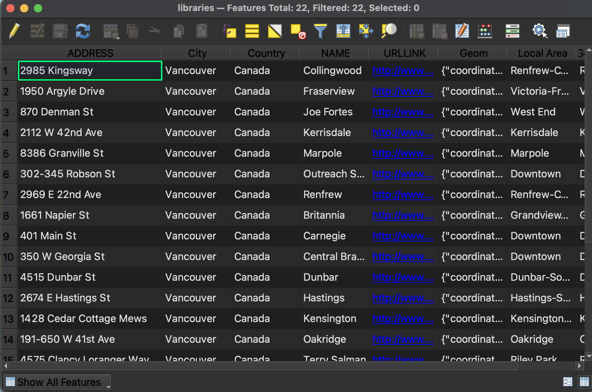
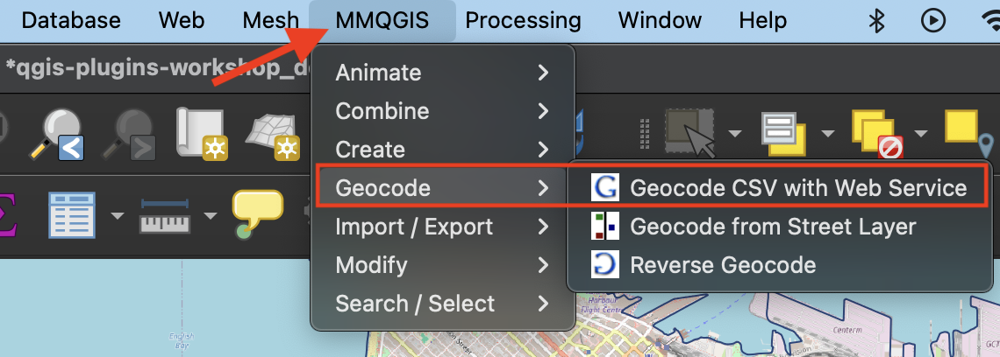
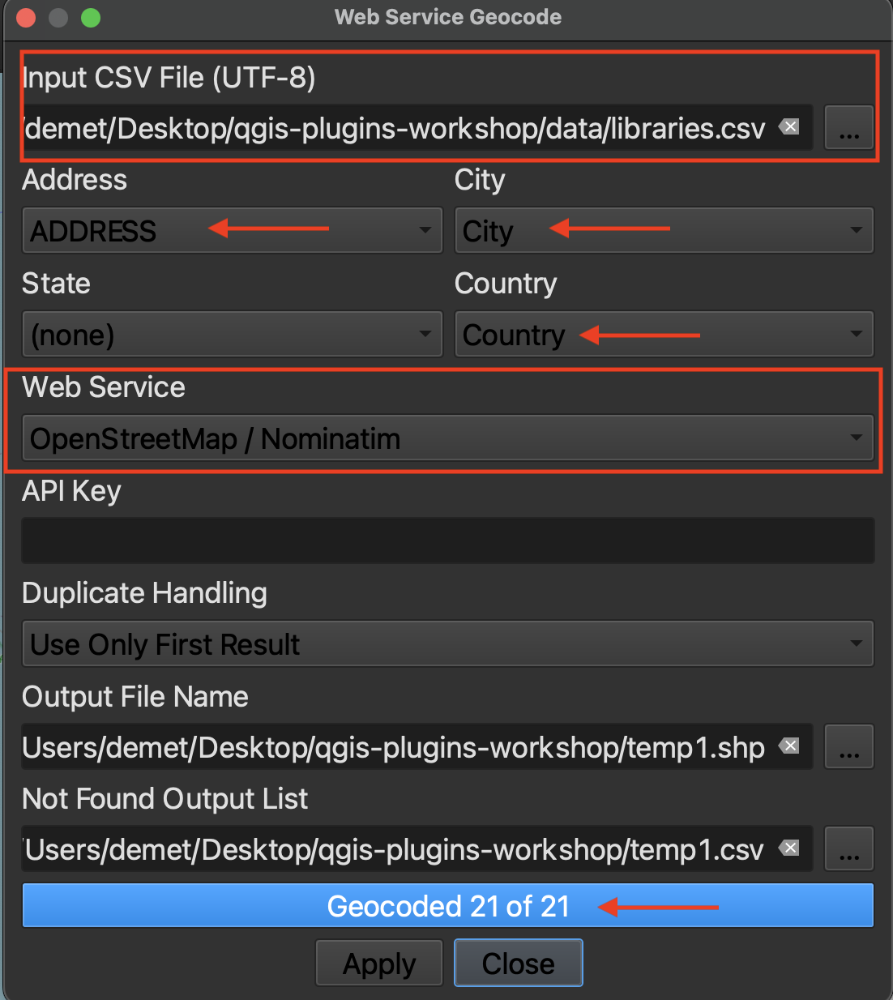

# Geocoding Address Data
Geocoding is a process by which addresses are given coordinate locations, thus allowing them to be manipulated in a GIS. In other words, geocoding transforms tabular data into spatial data. Reverse Geocoding is when you begin with a set of geolocated points (coordinates) and use a tool to get the street addresses of each point. This page will guide you through geocoding using the [**MMQGIS** plugin](https://plugins.qgis.org/plugins/mmqgis/). 

 

*1*{: .circle .circle-purple} From the workshop data folder, add `libraries.csv` to your QGIS project. This is a list of libraries in Vancouver, also downloaded from Vancouver's Open Data Portal. Because it is tabular data (in the form of a .csv, or comma separated value table) and not a spatial layer, nothing will show up on your map. Take a look at the attributes of this table. You'll see there are street address as well as city and country attributes. We'll use these to geocode this dataset. 

 

*2*{: .circle .circle-purple} Install **MMQGIS** plugin from the Plugins Manager. You'll see it adds an entire menu to the top of your screen. Take a look at different options. Choose **Geocode CSV with Web Service**.

 

*3*{: .circle .circle-purple} In the geocoding window that opens, chose the `libraries.csv` file as your input and leave the outputs as temporary files. The address, city, and country properties will likely auto-populate since the column names directly reference the input fields. Sometimes you *do* have to manually match the properties. 

Change the web service to **Open Street Map / Nominatim**. Hit apply. There are 21 rows in the library dataset so 21 points should be geocoded. The output csv that indicates what wasn't matched should be empty. 

 

*4*{: .circle .circle-purple} If you want to save your geocoded output as a spatial data layer, simply save the temporary file as a permanent layer. To do this, right-click the layer and **Export** it, giving it a name and appropriate storage location.

 

----
#### Resources
- See another [GeoCoding](https://plugins.qgis.org/plugins/GeoCoding/), another plugin specific to finding addresses or reverse geocoding
- See another resource on [Geocoding plugins](https://guides.library.ucsc.edu/DS/Resources/QGIS)

- You don't need to geocode in a GIS! If you aren't using a GIS for any other portion of your project, consider using an online geocoder like [BC Address Geocoder](https://www2.gov.bc.ca/gov/content/data/geographic-data-services/location-services/geocoder) or [geocodio](https://www.geocod.io/free-geocoding/), or explore more free and paid options [here](https://gisgeography.com/geocoders/)