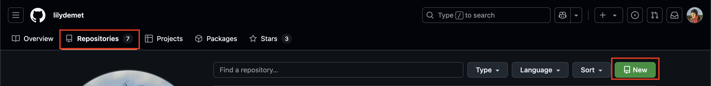
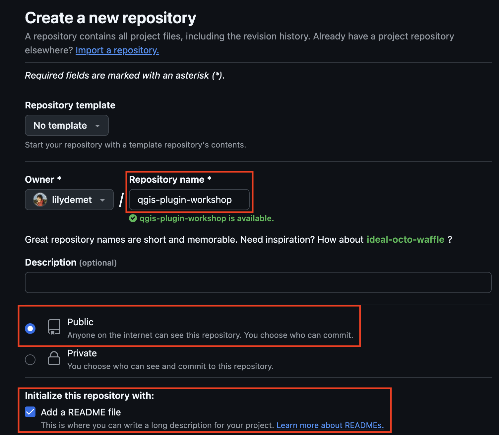
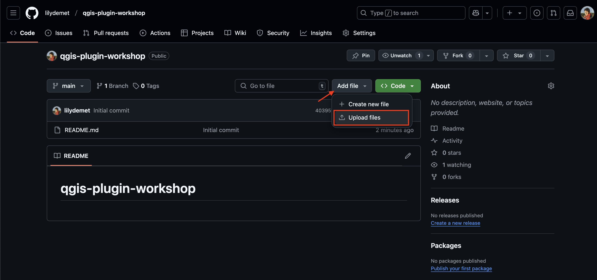
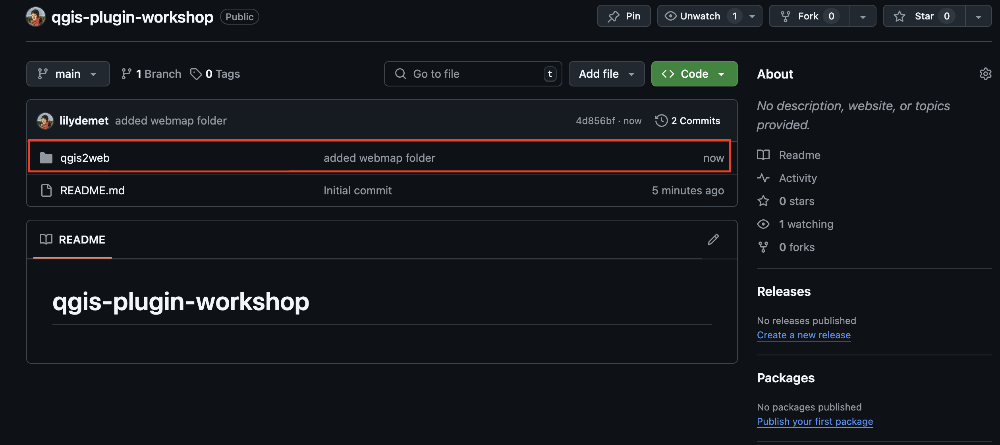
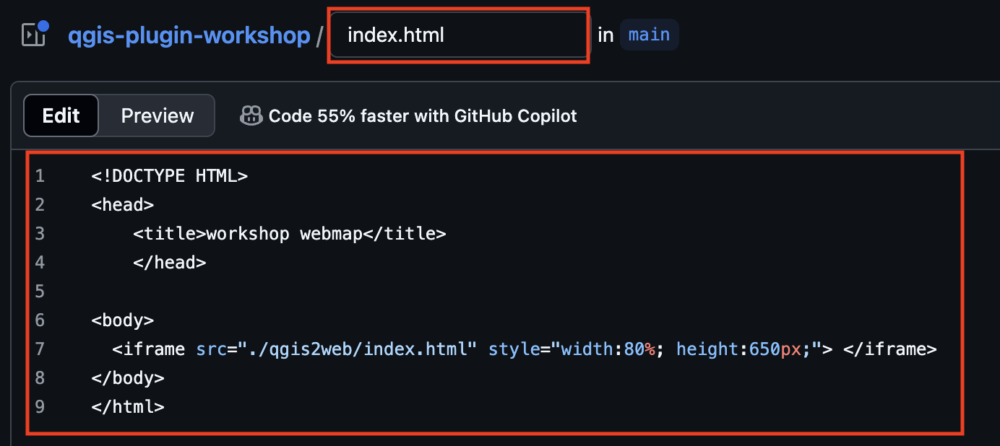
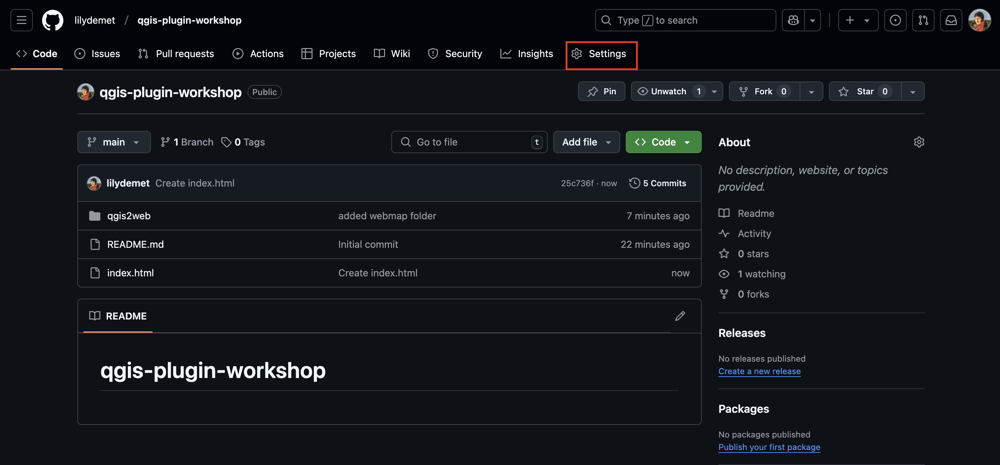
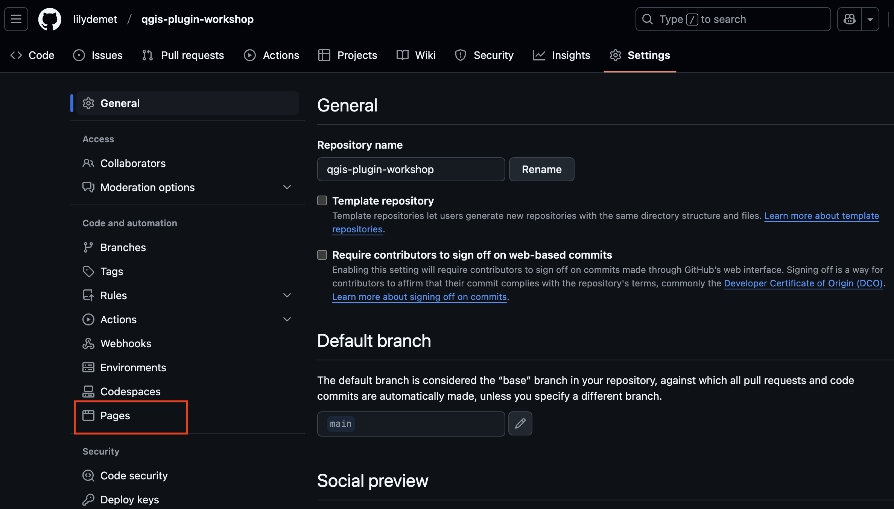
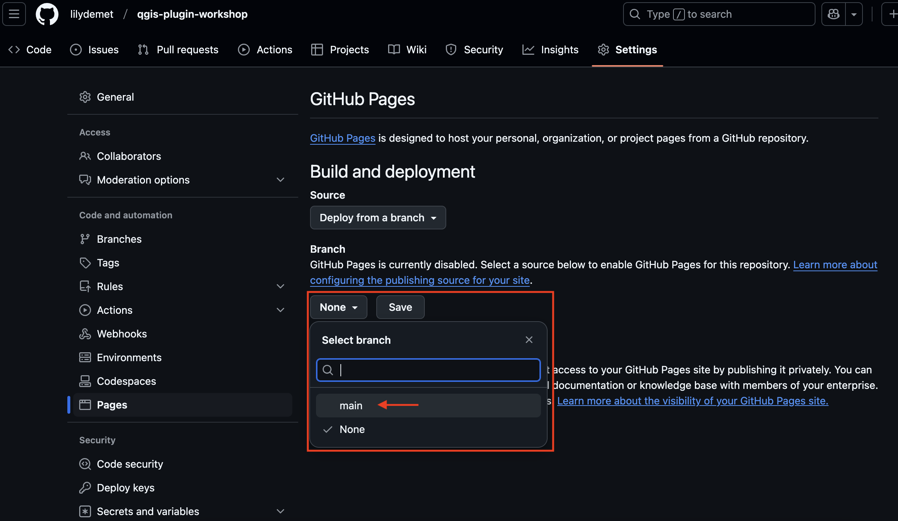
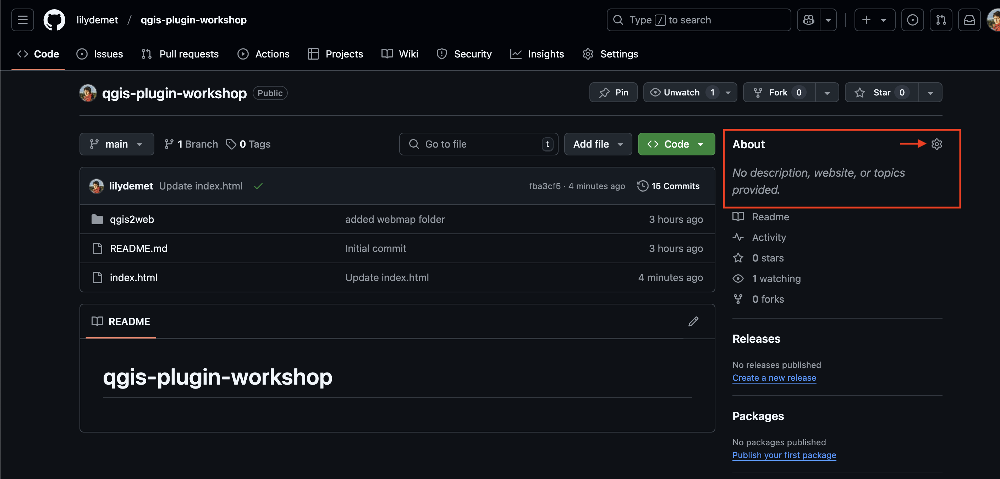

# Next Steps: Hosting a webmap

As is, your webmap created from QGIS project is a folder of files on your computer. You can open it locally, but no one else can access it unless you send them the folder to download to their own computer. This is where web hosting platforms come in. If you upload this folder to a cloud service then you can make the map viewable in web browsers. 

If you have a website  and access to local server, that's an option.

A low-barrier solution is Github. Github is xyz. See library workshop for more. 
between computer and web account. but we can also work exclusively directly from web interface. the steps to host your dynamic on the web using github are as follows:

1. create a free github account
2. make a new repository 
3. upload your data folder to the repository
4. create an index file
5. Make github page from index file 


## 1. Create a Github account


## 2. Make a new repository

Once you've made an account, go to **Repositories** and make a new repository (aka repo). A repository is like a folder that contains a project. 




Call the repository `qgis-plugin-workshop` followed by your initials

Set the visibility to **Public**

Add README.md. This is where you can give a brief description of what the project is. 




When working on your own projects, if you choose to set a license at this stage, ensure you have permissions to use all the data you do in the way you are licensing it. Never upload confidential datasets to a publically visible github repository. 


Scroll down to the bottom and **Create repository**.

## 3. Upload your webmap folder to your repository




IMPORTANT: before uploading your webmap folder, delete the numbers trailing the name so that the folder is now named only `qgis2web`. Drag and drop your folder to upload. when done, scroll down to bottom of screen and commit changes with message `added webmap folder`.


you should now see your file in your repository 





## 4. Create index file
Now create an index file so that your map can be embedded there. 
Go to **Add file** and this time select **+Create new file**. Copy and paste the below code into the file:

```html
<!DOCTYPE HTML>
<head>
    <title>workshop webmap</title>
    </head>

<body>
  <iframe src="./qgis2web/index.html" style="width:80%; height:650px;"> </iframe>
</body>
</html>
```


Give the file name `index.html` and commit.





## 5. make page from index file
now make page - little website from index file that will display the map we embedded in it. 
Go to repo settings




<br>

go to pages




change branch to **Main** and **SAVE**



once you hit save, give it a minute to build. 

refresh your page. 

visit site.

copy the link

return to your repo 

add link to about



