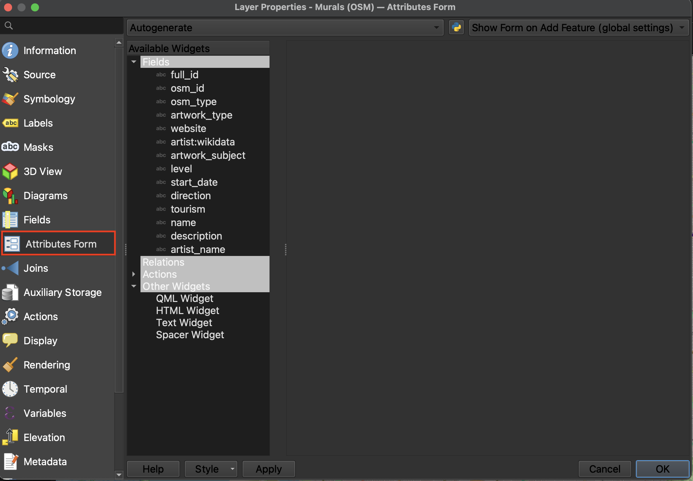
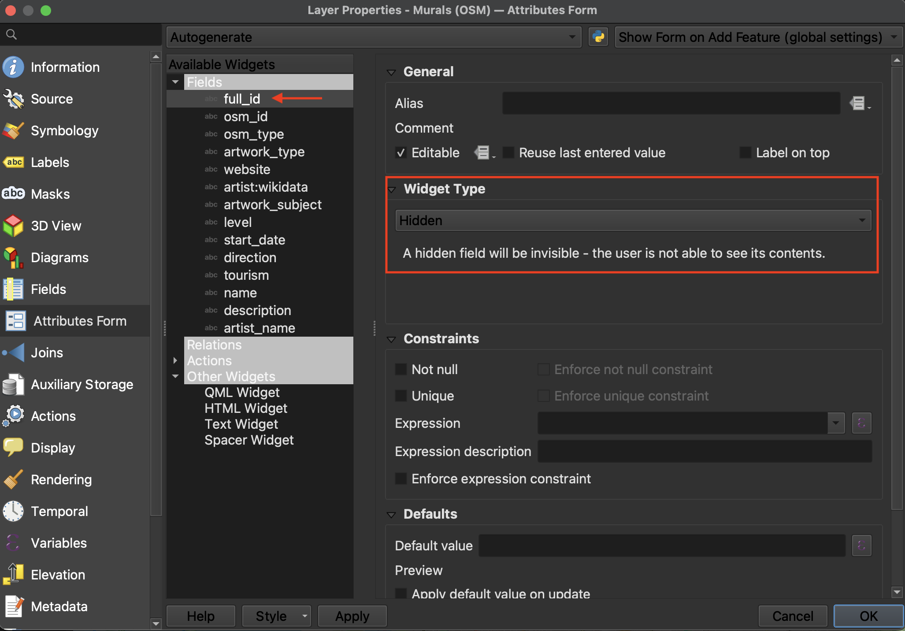
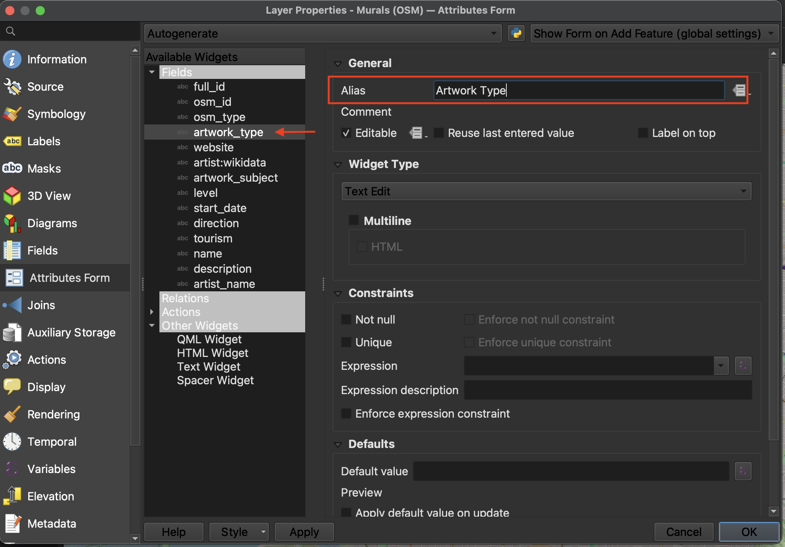

# Preparing the QGIS Project

First things first, let's prepare the QGIS project by doing the following:

>- Remove all temporary layers and csv files from your map. Remove `van-shoreline` as well. The basemap will provide the necessary context. Removing permanent layers from your Layers Panel does not delete the data, it simply removes the connection to your project. You can add them back at any time, though your symbology will be lost unless saved as a template. 

>- Ensure the symbology of your remaining layers are to your liking and that you are happy with your chosen basemap. 

>- Rename the remaining layers in your Layers Panel so it's clear what each layer is representing. Capitalize words, etc. qgis2web will create a table of contents using these layer names, so it's important to edit them *before* running the plugin. To rename layers, right click layer in Layers Panel and choose **Rename**. 

 

## Set field visibility in Attributes Form 
Each datapoint has a host of attribute data associated with it, as previously seen in the attribute table. In a dynamic and interactive webmap, this information will pop-up when a point is clicked. However, a lot of this information is extraneous and uncessary for the average user. To cut down on the amount of information rendered in each pop-up, we can customize which fields are visible and which ones are hidden. Technically you can do this from the qgis2web dialogue window, but it's much more difficult to get right. Thought time consuming, it may be wise to set each layer's attribute field visibility before converting your project into a webmap. 

 
<!-- To Do
{: .label .label-green } -->

*1*{: .circle .circle-purple}  Open **Properties** of the OSM murals layer, then navigate to **Attributes Form**. 

 

*2*{: .circle .circle-purple} Click through each Field (under "Available Widgets" in the middle column). Unless the Field is giving information about the artwork type or artist, turn the **Widget Type** to **Hidden**.

 

*3*{: .circle .circle-purple} If the Field name has an underscore, such as is the case with "artwork_type", consider giving it an Alias by which it will be named in the popup. For example, "Artwork Type". This just cleans up your table of contents without actually editing the attribute table.

 

*4*{: .circle .circle-purple} When you're done, hit **OK** and continue on to the other layers. 
