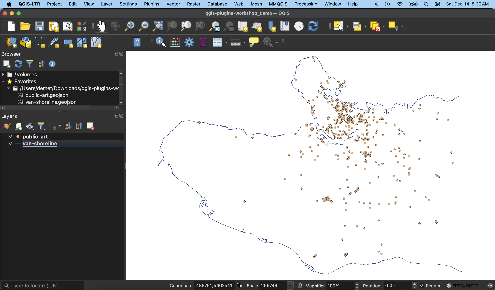

# Project Setup

A QGIS project for today's workshop as already been prepared for you. To open it, download and unzip the workshop data folder [here](./qgis-plugins-workshop.zip). Enter the folder and double-click on the file named `qgis-plugins_YOURNAME.qgz`.

The initial view will look something like the image below. If your screen is blank when the project opens, zoom to the layer `van-shoreline`. (To "zoom to" a layer, right-click it in your Layers Panel and choose to "zoom to".)

> You can change the way your layers are rendered by right-clicking the layer in your **Layers Panel** and going to **Properties** and then **Symbology**. You can also check the projection, metadata, and more of any layer by opening the layer **Properties**. 

> You can explore a layer's associated tabular data by right-clicking the layer in your **Layers Panel** and selecting **Open Attribute Table** 

> You can check and change the projection of your entire project by going to the **Project** menu at the top of your screen, then opening the project's **Properties**. Changing a project's projection will not change the stored projection of any of your layers; it will simply re-project them "on-the-fly" to all match the project projection. Notice the workshop project's projection is set to NAD83 / UTM zone 10N. This means it's using the North American Datum from 1983, and it's projected coordinate system is the Universal Transverse Mercator,  specific to the longitude that runs through Vancouver and the west coast of the USA. 

Before moving on: From the **Project** menu at the top of your screen, choose **Save as** and save your project with your name. 
{: .warn}

----
#### Additional Resources
- For more detailed walk-through of project setup and QGIS graphical user interface (GUI), see [here](https://ubc-library-rc.github.io/gis-tools-workflows/content/project-setup.html).
- For further explanation of coordinate reference systems, see [here](https://ubc-library-rc.github.io/gis-georeferencing/content/projections.html).
- For more information on working with projections in QGIS, see [here](https://docs.qgis.org/3.34/en/docs/user_manual/working_with_projections/working_with_projections.html). 

