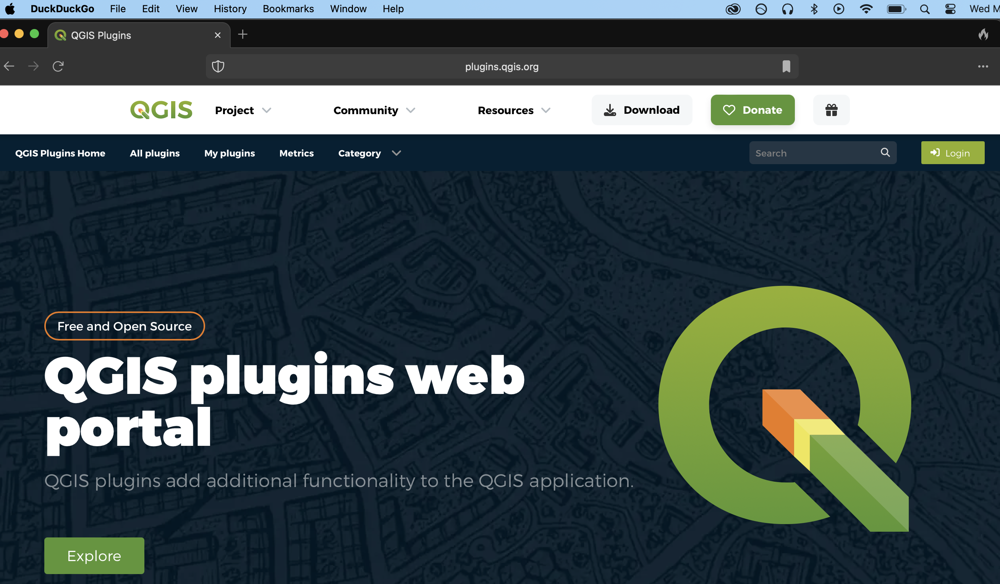

# What are QGIS Plugins?

[QGIS plugins](https://plugins.qgis.org/) are user developed tools that extend QGIS functionality beyond the basics. Explore the QGIS [list of plugins](https://plugins.qgis.org/plugins/) or search by Plugin Tags such as [cartography](https://plugins.qgis.org/plugins/tags/cartography/), [CSV](https://plugins.qgis.org/plugins/tags/csv/), or most [popular](https://plugins.qgis.org/plugins/popular/). 

Plugins can be downloaded directly from the web, or from within the QGIS interface. To download plugins from within the QGIS interface, click on the **Plugin** menu at the top of your screen and select **Manage and Install Plugins...**. Go down to Settings and ensure you are including Experimental Plugins in your search.

When you download plugins, they will show up as additional tools in your menu drop downs as well as toolbox. If you can't find a plugin, you can always search it by name in the **Help** menu. You only have to install plugins once. However, sporadically you will get a notification upon opening QGIS to update a plugin. You can update any plugin by simply searching it in the Plugins Manager and following the button prompts. If you ever install a new version of QGIS, you *will* have to re-install your plugins. 
{: .note}

